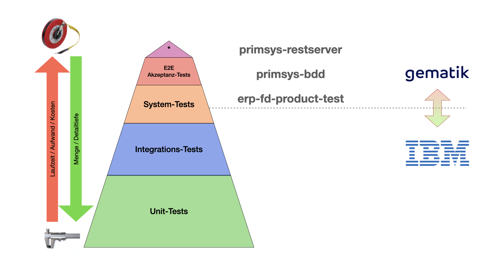
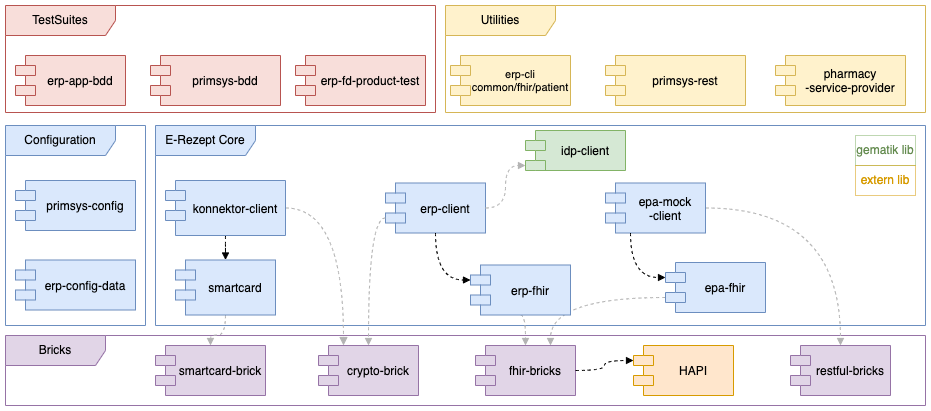

 <br/> 

# E-Rezept TestSuite
<!-- TOC -->
* [E-Rezept TestSuite](#e-rezept-testsuite)
  * [About The Project](#about-the-project)
    * [Release Notes](#release-notes)
  * [Getting Started](#getting-started)
    * [primsys-restserver](#primsys-restserver)
    * [primsys-bdd](#primsys-bdd)
    * [erp-fd-product-test](#erp-fd-product-test)
    * [erp-app-bdd](#erp-app-bdd)
    * [Prerequisites](#prerequisites)
    * [Installation](#installation)
  * [Usage](#usage)
  * [Contributing](#contributing)
  * [License](#license)
  * [Contact](#contact)
<!-- TOC -->

---

[](https://github.com/gematik/api-erp)
[](https://github.com/eRP-FD/)

[](https://www.das-e-rezept-fuer-deutschland.de/)
[](https://fachportal.gematik.de/hersteller-anbieter/komponenten-dienste/e-rezept-fachdienst)

## About The Project

The **E-Rezept TestSuite** is divided into several parts and is intended to cover the upper part of the test pyramid.



### Release Notes
See [ReleaseNotes.md](./ReleaseNotes.md) for all information regarding the (newest) releases.

## Getting Started

To get started with the test suite, it is important to understand the architecture of the testsuites and their core modules:



### primsys-restserver
Primarily serves as a test data generator to assist in **manual/exploratory testing** of the e-prescription.

For further information, please see the [full documentation](docs/primsys-rest/user_manual.adoc)

### primsys-bdd
Is the end-to-end test suite and focuses mainly on **acceptance tests**.
These test scenarios are described with the description language [Gherkin](https://cucumber.io/docs/gherkin/reference/). The feature-files describing the test scenarios are located at `primsys-bdd/src/test/resources/features`

For further information, please see the [full documentation](docs/testsuites/user_manual.adoc)

### erp-fd-product-test
The _"product testsuite"_ is focused on **system testing** and the coverage of specific requirements. 
The test cases are utilising [JUnit5](https://junit.org/junit5/docs/current/user-guide/) and are located at `erp-fd-product-test/src/integration-test`

For further information, please see the [full documentation](docs/testsuites/user_manual.adoc)

### erp-app-bdd
This testsuite focuses the end-to-end integration with the [E-Rezept-App-iOS](https://github.com/gematik/E-Rezept-App-iOS) by using [Appium](https://appium.io/docs/en/2.1/).
The feature-files describing these test scenarios are located at `erp-app-bdd/src/test/resources/features`

For further information, please see the [full documentation](docs/testsuites/user_manual.adoc)

### Prerequisites

To be able to **build** testsuites, make sure you have all the following required prerequisites on your development machine:

- Java 17 and Maven

In order to be able to **run** the testsuites, you must also ensure that the following prerequisites are met on your development computer

- Reachability of the [TI](https://www.gematik.de/telematikinfrastruktur)
- Authorization<sup>1</sup>

Because this information<sup>1</sup> is very sensitive and must be authorized per user, it is not publicly available here. 
Within, e.g., the configuration files; you can easily identify these fields:

````yaml
environments:
  - name: TU
    tslBaseUrl: https://download-ref.tsl.ti-dienste.de/ECC/
    ti:
      discoveryDocumentUrl: https://...
      fdBaseUrl: https://...
      subscriptionServiceUrl: wss://...
      userAgent: DUMMY VALUE  # <-- not public
    internet:
      discoveryDocumentUrl: https://...
      fdBaseUrl: https://...
      xapiKey: DUMMY VALUE    # <-- not public
      userAgent: DUMMY VALUE  # <-- not public
````

If you are interested in running testsuite, please use the [contact](#contact) options below.

### Installation

All modules and consequently the whole project can be built using maven

````
  mvn clean install -DskipTests
````

or just to run the unit tests

````
  mvn clean test
````

## Usage

To execute the testsuites, maven is used as well:

Run the [E2E Testsuite](#primsys-bdd)
````
  mvn -f primsys-bdd/pom.xml clean verify -Dskip.unittests
````

respectively, run the [System Testsuite](#erp-fd-product-test)
````
  mvn -f erp-fd-product-test/pom.xml clean verify -Dskip.unittests
````

respectively, run the [App Testsuite](#erp-app-bdd)
````
  mvn -f erp-app-bdd/pom.xml clean verify -Dskip.unittests
````

For further information on executing the testsuites, please see the [full documentation](docs/testsuites/user_manual.adoc)

## Contributing
If you want to contribute, please check our [CONTRIBUTING.md](./CONTRIBUTING.md).

## License

Copyright 2023 gematik GmbH

Licensed under the Apache License, Version 2.0 (the "License"); you may not use this file except in compliance with the License.

See the [LICENSE](./LICENSE) for the specific language governing permissions and limitations under the License.

Unless required by applicable law the software is provided "as is" without warranty of any kind, either express or implied, including, but not limited to, the warranties of fitness for a particular purpose, merchantability, and/or non-infringement. The authors or copyright holders shall not be liable in any manner whatsoever for any damages or other claims arising from, out of or in connection with the software or the use or other dealings with the software, whether in an action of contract, tort, or otherwise.

The software is the result of research and development activities, therefore not necessarily quality assured and without the character of a liable product. For this reason, gematik does not provide any support or other user assistance (unless otherwise stated in individual cases and without justification of a legal obligation). Furthermore, there is no claim to further development and adaptation of the results to a more current state of the art.

Gematik may remove published results temporarily or permanently from the place of publication at any time without prior notice or justification.

## Contact
E-Mail to [Medical Entwicklung](mailto:medical-entwicklung@gematik.de?subject=[GitHub]%20E-Rezept%20Testsuite)